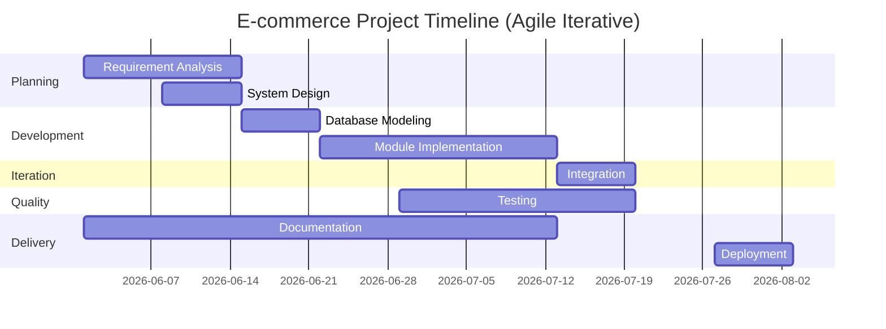

# Software Development Life Cycle (SDLC) Methodology

## SDLC Model: Agile Iterative Model with Incremental Delivery

The project will adopt the **Agile Iterative SDLC model**, combining structured phases with iterative cycles. This model will be followed because the e-commerce platform will consist of independently developable modules (authentication, products, cart, orders, admin dashboard, and AI shopping assistant), each of which will be built, tested, and refined in sprints before integration. The iterative approach will allow incremental delivery of working features, continuous feedback incorporation, and adaptive refinement based on testing outcomes at each stage.

---

## Phase 1: Requirement Analysis and Planning

The team will gather and document all functional and non-functional requirements for the e-commerce platform. Requirements will be derived from expected modern e-commerce system behavior and will cover user stories, acceptance criteria, and technical constraints. The identified modules will include:

- User Authentication & Authorization
- Product Catalog Management
- Shopping Cart Functionality
- Order Processing & Management
- Admin Dashboard
- AI Shopping Assistant

After requirement gathering, the project scope will be finalized, a sprint backlog will be created, and the project timeline with milestones will be established.

---

## Phase 2: System Design and Architecture

The system architecture will be designed in this phase. This will include:

- **Technology Stack Selection**: Frontend framework, backend framework, database management system, and any supporting technologies will be selected based on project requirements.
- **Database Design**: Relational database schemas will be designed to support all data models including users, products, orders, carts, and AI assistant interactions.
- **API Design**: RESTful or GraphQL API specifications will be created to define contracts between frontend and backend modules.
- **UI/UX Design**: Wireframes and mockups will be prepared for the customer-facing interface, admin dashboard, and AI assistant interface.
- **Infrastructure Planning**: Deployment environment, CI/CD pipeline, and security architecture will be planned.

All design decisions will be documented in architecture diagrams, API documentation, and design guidelines.

---

## Phase 3: Database Modeling

The database schema will be modeled based on the system design decisions. This will include:

- Entity-Relationship Diagrams (ERD) defining relationships between users, products, orders, and other entities.
- Table definitions with appropriate data types, constraints, and indexes for performance optimization.
- Foreign key relationships to maintain data integrity across modules.
- Migration scripts for database creation and version control.

The database model will be normalized to eliminate redundancy while maintaining query performance for expected workloads.

---

## Phase 4: Module-Wise Implementation

Each module will be developed independently in iterative sprints. The implementation order will be:

1. **Authentication Module**: User registration, login, password management, role-based access control, and session management.
2. **Product Catalog Module**: Product CRUD operations, category management, search and filtering, image handling, and inventory tracking.
3. **Cart Module**: Add-to-cart, update quantities, remove items, cart persistence, and price calculation.
4. **Order Module**: Checkout process, order creation, order history, order tracking, and payment integration.
5. **Admin Dashboard Module**: Product management, order management, user management, analytics, and reporting.
6. **AI Shopping Assistant Module**: Conversational interface, product recommendations, order assistance, and FAQ handling.

Each module will follow the test-driven development (TDD) approach where applicable, with unit tests written alongside implementation code.

---

## Phase 5: Integration

After individual modules are completed and tested, they will be integrated into a cohesive system. This phase will include:

- Backend API integration across all modules.
- Frontend-backend integration and data flow validation.
- Third-party service integration (payment gateways, email services, AI services).
- End-to-end workflow testing of complete user journeys.

Integration issues will be identified, documented, and resolved iteratively.

---

## Phase 6: Testing

Comprehensive testing will be performed across multiple levels:

- **Unit Testing**: Individual functions and components will be tested for correctness.
- **Integration Testing**: Module interactions and API endpoints will be tested.
- **System Testing**: Complete system workflows will be validated against requirements.
- **User Acceptance Testing (UAT)**: The application will be tested by stakeholders to ensure it meets business requirements.
- **Performance Testing**: Load testing and stress testing will be conducted to ensure system scalability.
- **Security Testing**: Authentication, authorization, data protection, and vulnerability assessments will be performed.

All identified bugs will be logged, prioritized, and fixed before proceeding to the next phase.

---

## Phase 7: Documentation

Complete documentation will be produced for the e-commerce platform:

- **Technical Documentation**: API documentation, database schema documentation, architecture overview, and deployment guides.
- **User Documentation**: User guides, admin manuals, and feature documentation.
- **Developer Documentation**: Code comments, setup instructions, contribution guidelines, and development workflow.

Documentation will be maintained throughout the development process and will be kept in sync with code changes.

---

## Phase 8: Deployment and Final Evaluation

The application will be deployed to a production environment following the deployment strategy planned in Phase 2. This phase will include:

- Environment setup and configuration.
- Data migration and seeding.
- Production deployment and smoke testing.
- Monitoring and logging setup.
- Backup and recovery procedures.

The final evaluation will assess the system against the original requirements. Metrics such as performance benchmarks, feature completeness, code quality, and user satisfaction will be evaluated. Based on the evaluation, a maintenance and iteration plan will be prepared for future enhancements.

---

## Gantt Chart

### Simple Timeline (Agile Iterative)

| Task                  | Week 1 | Week 2 | Week 3 | Week 4 | Week 5 | Week 6 |
|-----------------------|--------|--------|--------|--------|--------|--------|
| Requirement Analysis  | ✔      | ✔      |        |        |        |        |
| System Design         |        | ✔      | ✔      |        |        |        |
| Database Modeling     |        |        | ✔      |        |        |        |
| Module Implementation |        |        | ✔      | ✔ | ✔      | ✔ |
| Integration           |        |        |        | ✔ | ✔      |        |
| Testing               |        |        | ✔      | ✔ | ✔      | ✔      |
| Documentation         | ✔      | ✔      | ✔      | ✔      | ✔      | ✔      |
| Deployment            |        |        |        |        |        | ✔      |

---

## Justification for Choosing the Agile Iterative Model

The Agile Iterative model will be chosen for this e-commerce project because:

1. **Modular Architecture**: The platform's distinct modules (authentication, products, cart, orders, admin dashboard, AI assistant) will lend themselves well to iterative development, allowing each module to be built as a self-contained increment.
2. **Changing Requirements**: E-commerce platforms often require adaptation based on market feedback and business needs. The iterative model will accommodate requirement changes through sprint-based refinement.
3. **Continuous Delivery**: Working increments will be delivered at the end of each sprint, allowing stakeholders to see progress and provide feedback early.
4. **Risk Mitigation**: Each iteration will include testing, allowing risks to be identified and addressed early in the development cycle rather than at the end.
5. **Team Collaboration**: The iterative approach will promote continuous collaboration between developers, testers, designers, and stakeholders.
