

<h1>👟 Nike E-Commerce Store</h1>

A modern, high-performance e-commerce storefront inspired by <strong>Nike</strong>, built with
<strong>Next.js</strong>, <strong>Tailwind CSS</strong>, and <strong>Shadcn UI</strong>.

This project demonstrates a complete shopping flow — from product discovery to
form-validated checkout — with a premium, responsive UI.

<h2>🚀 Features</h2>

<ul>
  <li><strong>Dynamic Product Listing</strong> — Fetches and displays products using a REST API</li>
  <li><strong>Modern UI / UX</strong> — Clean, premium interface powered by Shadcn UI</li>
  <li><strong>Robust Backend</strong> — Node.js and Express server with MongoDB database</li>
  <li><strong>Powerful Admin Dashboard</strong> — Comprehensive panel for managing products, orders, users, and store settings</li>
  <li><strong>AI Chat Assistant</strong> — Intelligent customer support powered by OpenAI</li>
  <li><strong>Authentication & Security</strong> — Secure login and session management using JWT</li>
  <li><strong>Order & Email Notifications</strong> — Integrated email automation for order confirmations</li>
  <li><strong>Interactive Maps</strong> — Custom Mapbox/MapLibre integration with custom markers</li>
  <li><strong>Robust Form Handling</strong> — Login & checkout forms built with Formik and Yup validation</li>
  <li><strong>Fast Performance</strong> — Leveraging Next.js server components and optimized images</li>
</ul>

<h2>🛠️ Tech Stack</h2>

<table>
  <thead>
    <tr>
      <th align="left">Technology</th>
      <th align="left">Purpose</th>
    </tr>
  </thead>
  <tbody>
    <tr>
      <td>Next.js</td>
      <td>Framework for SSR, routing, and performance optimization</td>
    </tr>
    <tr>
      <td>React</td>
      <td>UI library for building reusable components</td>
    </tr>
    <tr>
      <td>Node.js & Express</td>
      <td>Backend server and RESTful API architecture</td>
    </tr>
    <tr>
      <td>MongoDB</td>
      <td>NoSQL database for flexible data modeling</td>
    </tr>
    <tr>
      <td>Tailwind CSS</td>
      <td>Utility-first styling and responsive design</td>
    </tr>
    <tr>
      <td>Shadcn UI</td>
      <td>Accessible, modern UI components</td>
    </tr>
    <tr>
      <td>OpenAI (gpt-4o-mini / gpt-5-nano)</td>
      <td>Powers the intelligent chat assistant</td>
    </tr>
    <tr>
      <td>Formik & Yup</td>
      <td>Form state management and validation</td>
    </tr>
    <tr>
      <td>JWT & bcrypt</td>
      <td>Authentication and password security</td>
    </tr>
  </tbody>
</table>

<h2>🖥️ Run the Project Locally</h2>

<h3>1️⃣ Clone the Repository</h3>

<pre>
git clone https://github.com/your-username/ecommerce.git
</pre>

<h3>2️⃣ Navigate to the Project Folder</h3>

<pre>
cd new_ecommerce
</pre>

<h3>3️⃣ Install Dependencies</h3>

Make sure you have <strong>Node.js (>= 18)</strong> installed.

<pre>
npm install
</pre>

This will install all required packages including:

<ul>
  <li>Next.js</li>
  <li>React</li>
  <li>Tailwind CSS</li>
  <li>Shadcn UI</li>
  <li>Formik & Yup</li>
  <li>Lucide-React</li>
  <li>Other dependencies listed in <code>package.json</code></li>
</ul>

<h2>⚙️ Manual Installation (Optional)</h2>

If you want to install each major component individually:

<h4>Next.js & React</h4>
<pre>
npm install next react react-dom
</pre>

<h4>Tailwind CSS</h4>
<pre>
npm install -D tailwindcss postcss autoprefixer
npx tailwindcss init -p
</pre>

<h4>Shadcn UI</h4>
<pre>
npx shadcn-ui init
</pre>

<h4>Formik & Yup</h4>
<pre>
npm install formik yup
</pre>

<h4>Lucide-React</h4>
<pre>
npm install lucide-react
</pre>

<h2>📸 Screenshots</h2>

Here is a glimpse of the website:

  <h3>🏠 Home Page</h3>
  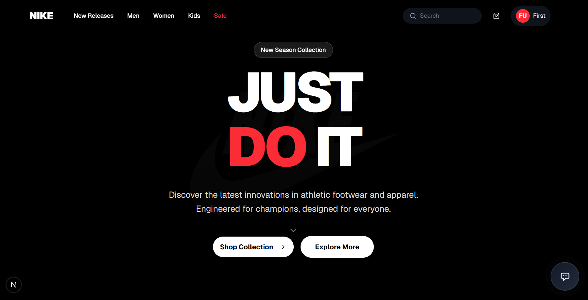
    

  <h3>🛍️ Products Collection</h3>
  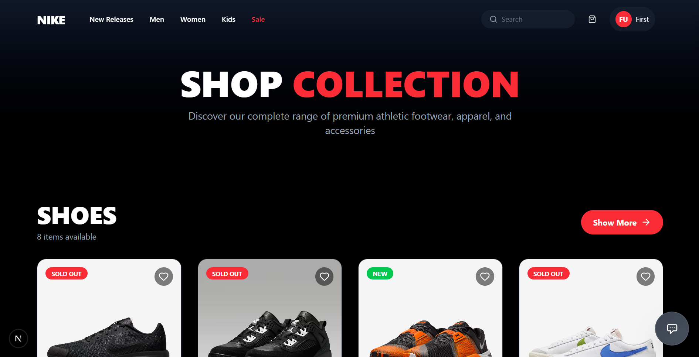
    

  <h3>👟 Product Details</h3>
  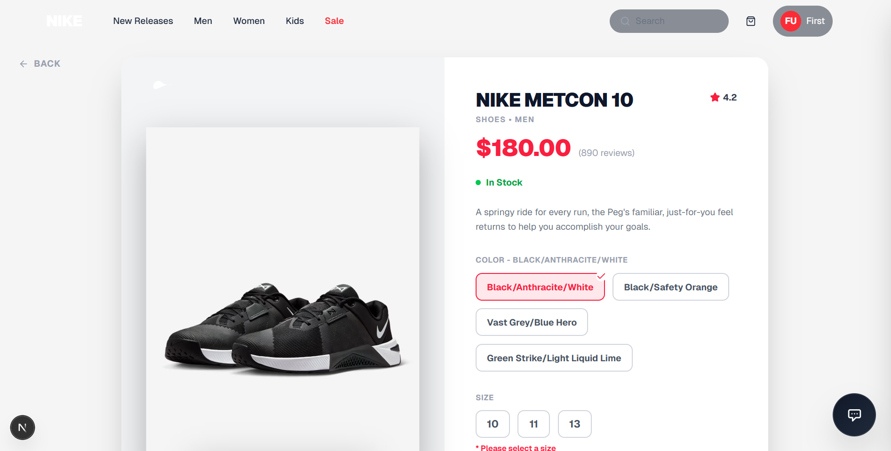
    

  <h3>🛒 Shopping Cart & Checkout</h3>
  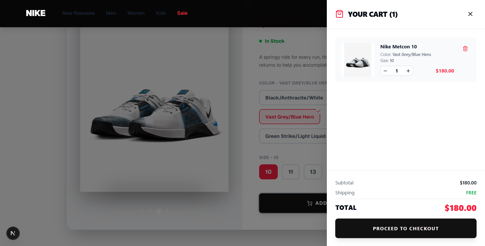
  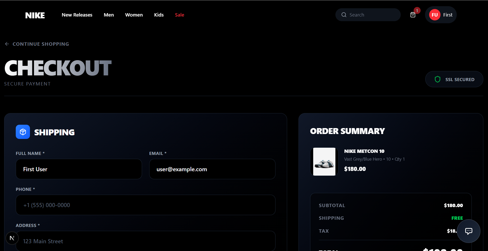
    

  <h3>💳 Payment & Success</h3>
  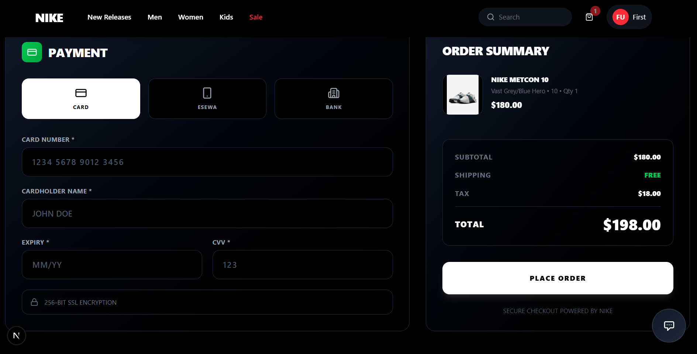
  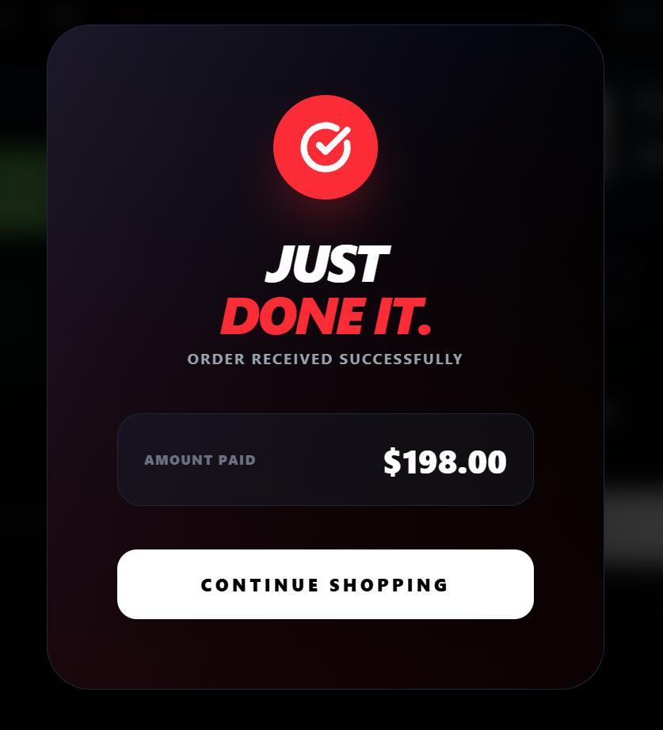
    

  <h3>👤 User Profile & Email Notification</h3>
  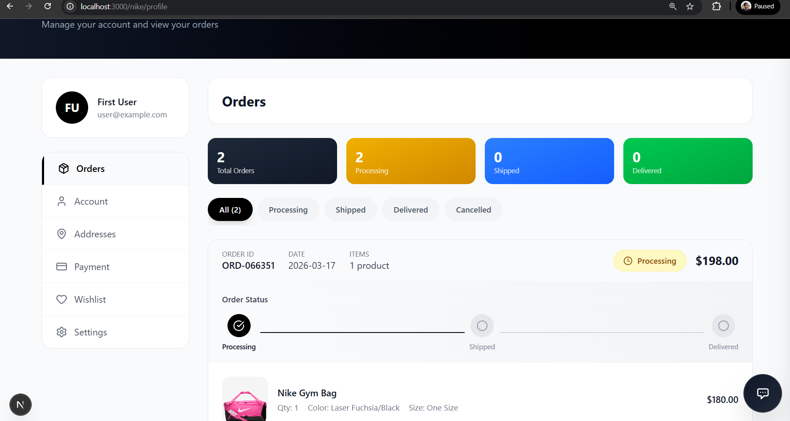
  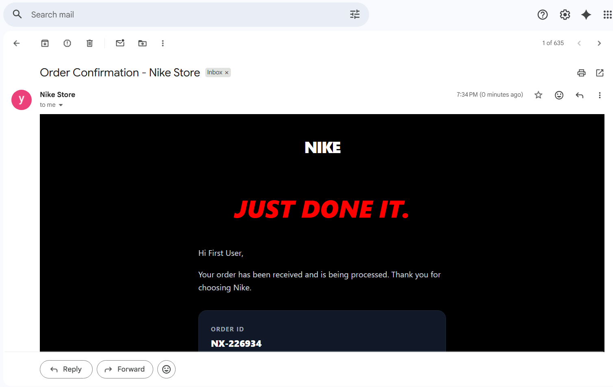
    

  <h3>🔐 Authentication (Login & Sign Up)</h3>
  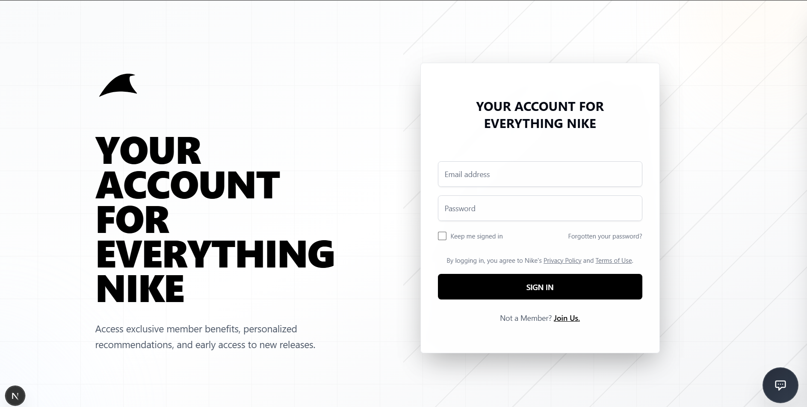
  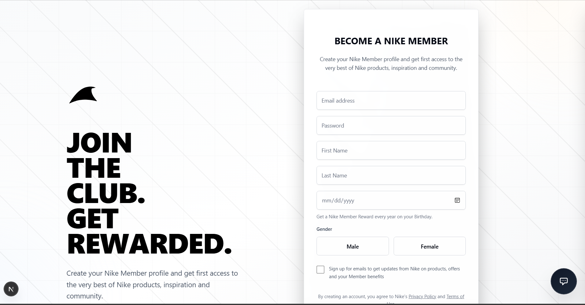
    

  <h3>🛠️ Admin Dashboard</h3>
  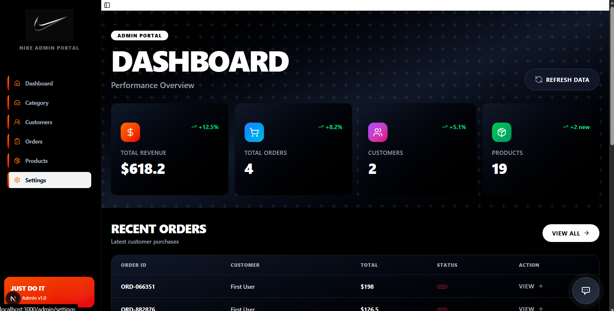
    
  
  <h3>📦 Admin Orders & Settings</h3>
  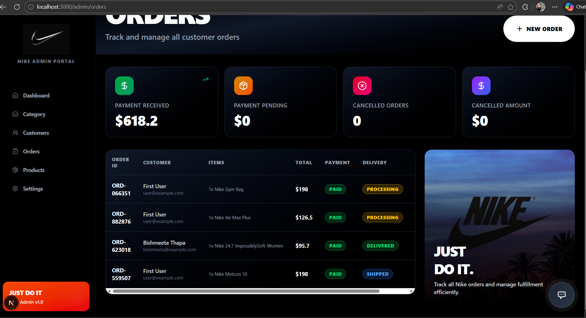
  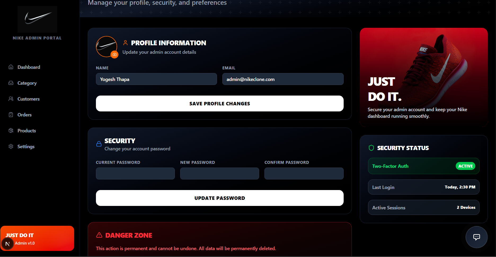
    

<h2>🔮 Future Updates</h2>

This project is continuously evolving. Here are some planned features and improvements:

<ul>
  <li><strong>Enhanced Search Functionality</strong> — Advanced product search with filters, sorting, and real-time suggestions</li>
  <li><strong>Wishlist & Favorites</strong> — Allow users to save products for later</li>
  <li><strong>Product Reviews & Ratings</strong> — Customer reviews and star ratings system</li>
  <li><strong>Inventory Management</strong> — Stock tracking and low-stock alerts</li>
  <li><strong>Coupon & Discount Codes</strong> — Promo code functionality for discounts</li>
  <li><strong>Multi-payment Gateway Integration</strong> — Support for Stripe, PayPal, and other payment methods</li>
  <li><strong>Order Tracking</strong> — Real-time order status and shipping tracking</li>
  <li><strong>Advanced Analytics Dashboard</strong> — Sales analytics, revenue reports, and customer insights</li>
  <li><strong>Blog / Content Management</strong> — News, announcements, and SEO content</li>
  <li><strong>Multi-language Support</strong> — Internationalization (i18n) for global audience</li>
  <li><strong>PWA (Progressive Web App)</strong> — Offline support and app-like experience</li>
  <li><strong>Social Media Integration</strong> — Share products and login via social accounts</li>
</ul>

  <em>Contributions and suggestions are welcome! Feel free to fork this project and add your own features.</em>

  <strong>⭐ If you like this project, consider giving it a star!</strong>

